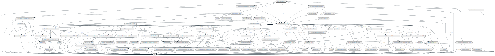

# UK Postcodes API Wrapper
[](https://travis-ci.org/gordonbanderson/ukpostcodes)
[](https://scrutinizer-ci.com/g/gordonbanderson/ukpostcodes/?branch=master)
[](https://codecov.io/github/gordonbanderson/ukpostcodes?branch=master)


[](https://packagist.org/packages/suilven/ukpostcodes)
[](//packagist.org/packages/suilven/ukpostcodes)
[](https://packagist.org/packages/suilven/ukpostcodes)
[](https://packagist.org/packages/suilven/ukpostcodes)
[](https://packagist.org/packages/suilven/ukpostcodes)
[](https://packagist.org/packages/suilven/ukpostcodes)
[](https://packagist.org/packages/suilven/ukpostcodes)

[](https://github.com/gordonbanderson/ukpostcodes)
[](https://github.com/gordonbanderson/ukpostcodes)
[](https://github.com/gordonbanderson/ukpostcodes)
[](https://github.com/gordonbanderson/ukpostcodes)
[](https://github.com/gordonbanderson/ukpostcodes/issues)


PHP client wrapper around the postcodes.io API service



# Usage
## Getting a PostCode
```php
$postcode = PostCodeFactory::get('KY16 9SS');
```
or
```php
$api = new Suilven\UKPostCodes\API();
$lookup = $this->api->lookup('KY16 9SS'');
```

## Getting Nearby PostCodes
```php
$postcode = PostCodeFactory::get('KY16 9SS');
$nearby = $postcode->nearest();
```
or
```php
$api = new Suilven\UKPostCodes\API();
$nearest = $this->api->nearest('SW1A 2AA');
```
## Bulk Lookup By PostCode
```php
$api = new Suilven\UKPostCodes\API();
$postcodeObjects = $this->api->bulkLookup([
    'SW1A 2AA',
    'KY16 9SS',
    'KY11 3ED'
]);
```

## Bulk Lookup By Coordinates
```php
$api = new Suilven\UKPostCodes\API();

$coors = [
   [
     'latitude' => 51.50354,
     'longitude' => -0.127695,
   ],
   [
     'latitude' => 56.340349,
     'longitude' => -2.808787,
   ],
   [
     'latitude' => 56.03587,
     'longitude' => -3.500364,
   ],
];
$bulkReversed = $this->api->bulkReverseGeocoding($coors);
```

## Bulk Lookup By Coordinates
Note that if the coordinates are outside of the UK, an empty array is returned by the API.
```php
$api = new Suilven\UKPostCodes\API();
$postcodeObjects = $this->api->nearestPostcodesFromLongLat(0.629834723775309, 51.7923246977375);
```

## Lookup Up A Terminated PostCode
Note that this will return a partially populated PostCode object.
```php
$api = new Suilven\UKPostCodes\API();
$terminated = $this->api->lookupTerminated('AB1 0AA');
```

## Lookup an Outward Code
An outcode is the part of a postcode prior to the space, e.g. `KY16` in `KY16 9SS`
```php
$api = new Suilven\UKPostCodes\API();
$lookup = $this->api->lookupOutwardCode('RH1');
```

## Lookup Outward Code By Coordinates
```php
$api = new Suilven\UKPostCodes\API();
$lookup = $this->api->nearestOutwardCodeFromLongLat(0.629834723775309, 51.7923246977375);
```

## Find the Nearest Outward Code to a Given Outward Code
```php
$api = new Suilven\UKPostCodes\API();
$nearest = $this->api->nearestOutwardCode('RH1');
```

## Autocomplete a PostCode
```php
$api = new Suilven\UKPostCodes\API();
$autocompletedPostCodes = $this->api->partial('SW16');
```

## Query a Partial PostCode
```php
$api = new Suilven\UKPostCodes\API();
$postcodeObjs = $this->api->query('SW16');
```

## Get a Random Postcode
```php
$api = new Suilven\UKPostCodes\API();
$random = $this->api->random();
```

## Get Distance Between Two PostCodes
```php
$api = new Suilven\UKPostCodes\API();
$distance = $this->api->distance('SW1A 2AB', 'EH99 1SP', Distance::KM);
```
If the distance units parameter is not provided, then the default is miles (`MILES`).  The other option is `NAUTICAL_MILES`.

## Check if a PostCode is Valid or Not
```php
$api = new Suilven\UKPostCodes\API();

// false as there is no space in the postcode
$validated = $this->api->validate('KYAB92A');
```
